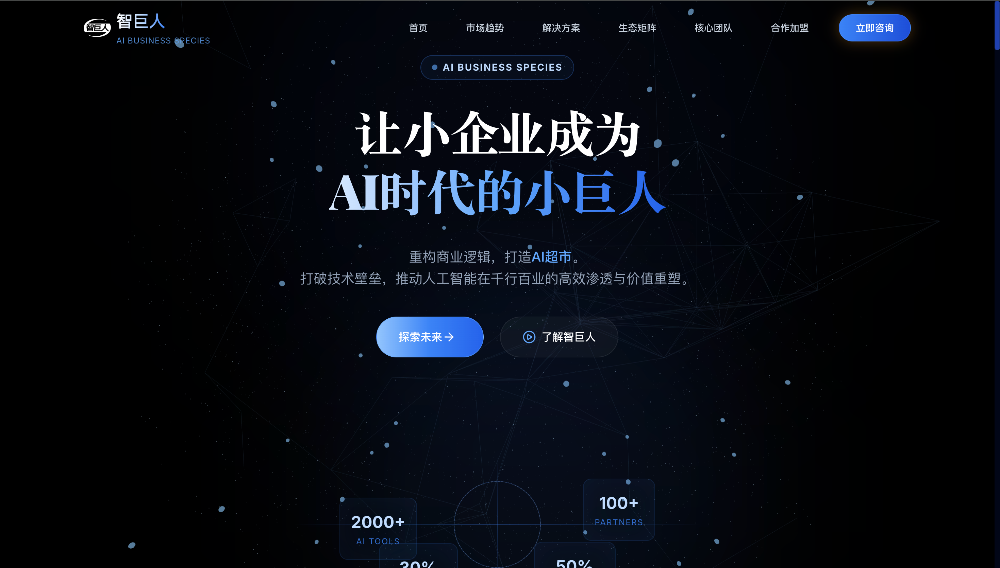

<h1 align="center">智巨人 AI Business Platform</h1>

<div align="center">

**让小企业成为AI时代的小巨人**

[](https://nextjs.org/)
[](https://react.dev/)
[](https://www.typescriptlang.org/)
[](https://threejs.org/)

</div>


## 目录

- [项目简介](#项目简介)
- [技术栈](#技术栈)
- [功能特性](#功能特性)
- [项目结构](#项目结构)
- [快速开始](#快速开始)
- [开发指南](#开发指南)
- [构建部署](#构建部署)
- [常见问题](#常见问题)

---

## 项目简介

**智巨人 (AI Business Platform)** 是杭州智巨人人工智能科技有限公司的官方网站，旨在展示公司形象、产品服务和商业合作机会。

### 核心定位

- **AI应用聚合平台**: 严选全球 2000+ AI 应用
- **全链路服务商**: 从体验到交付再到陪跑的闭环服务
- **产业赋能平台**: 推动AI技术在千行百业的落地应用

### 企业愿景

> 让天下没有难做的AI生意，赋能中小企业，重塑商业未来。

---

## 技术栈

### 前端框架

| 技术 | 版本 | 说明 |
|------|------|------|
| [Next.js](https://nextjs.org/) | 16.1.2 | React 全栈框架，支持 SSR/SSG |
| [React](https://react.dev/) | 19.2.3 | 用户界面构建库 |
| [TypeScript](https://www.typescriptlang.org/) | 5.8.2 | JavaScript 类型超集 |

### 核心依赖

| 库 | 版本 | 用途 |
|----|------|------|
| [@react-three/fiber](https://docs.pmnd.rs/react-three-fiber) | 9.5.0 | React 3D 渲染 |
| [@react-three/drei](https://github.com/pmndrs/drei) | 10.7.7 | Three.js 辅助工具 |
| [three](https://threejs.org/) | 0.182.0 | 3D 图形库 |
| [framer-motion](https://www.framer.com/motion/) | 12.26.2 | 动画库 |
| [lucide-react](https://lucide.dev/) | 0.562.0 | 图标库 |
| [recharts](https://recharts.org/) | 3.6.0 | 数据可视化 |

### 样式方案

- **Tailwind CSS 4.1.18**: 原子化 CSS 框架
- **CSS Modules**: 组件级样式隔离
- **PostCSS + Autoprefixer**: CSS 处理与兼容

### 构建工具

- **Turbopack**: Next.js 新一代构建引擎
- **SWC**: 超快的 JavaScript/TypeScript 编译器

---

## 功能特性

### 1. 沉浸式 3D 视觉体验

- 基于 React Three.js 的交互式 3D 背景
- 动态悬浮效果和粒子系统
- 滚动视差效果

### 2. 流畅的动画交互

- Framer Motion 驱动的页面动画
- 滚动触发的渐入效果
- 精致的 hover 微交互

### 3. 数据可视化

- Recharts 实现的增长趋势图表
- 动态数据展示
- 统计卡片动画

### 4. 响应式设计

- 移动端友好的导航菜单
- 自适应布局
- 触摸交互支持

### 5. 核心页面模块

| 模块 | 文件位置 | 功能描述 |
|------|----------|----------|
| 首页英雄区 | `src/features/hero/` | 3D 背景 + 核心标语 |
| 市场趋势 | `src/features/market/` | AI 市场增长数据图表 |
| 痛点分析 | `src/features/pain-points/` | 企业痛点展示 |
| 解决方案 | `src/features/solutions/` | 服务体系介绍 |
| 生态矩阵 | `src/features/ecosystem/` | 生态伙伴展示 |
| 团队介绍 | `src/features/team/` | 创始人及核心团队 |
| 合作加盟 | `src/features/recruit/` | 招募信息展示 |
| 联系弹窗 | `src/features/common/` | 用户联系表单 |

---

## 项目结构

```
ai-giant/
├── src/
│   ├── app/                    # Next.js App Router
│   │   ├── layout.tsx          # 根布局组件
│   │   ├── page.tsx            # 主页面入口
│   │   └── globals.css         # 全局样式
│   │
│   ├── features/               # 功能模块
│   │   ├── common/             # 通用组件
│   │   │   └── ContactModal.tsx
│   │   ├── ecosystem/          # 生态矩阵
│   │   │   └── Ecosystem.tsx
│   │   ├── hero/               # 首页英雄区
│   │   │   ├── Hero.tsx
│   │   │   └── Hero3DBackground.tsx
│   │   ├── market/             # 市场趋势
│   │   │   ├── MarketChart.tsx
│   │   │   └── MarketSection.tsx
│   │   ├── navigation/         # 导航组件
│   │   │   ├── Navbar.tsx
│   │   │   └── Footer.tsx
│   │   ├── pain-points/        # 痛点分析
│   │   │   └── PainPoints.tsx
│   │   ├── recruit/            # 合作加盟
│   │   │   └── Recruit.tsx
│   │   ├── solutions/          # 解决方案
│   │   │   └── SolutionSection.tsx
│   │   └── team/               # 团队介绍
│   │       └── Team.tsx
│   │
│   ├── lib/                    # 工具库
│   │   └── constants/          # 常量定义
│   │       ├── index.tsx       # 主要数据
│   │       └── types.ts        # 类型定义
│   │
│   └── styles/                 # 样式文件
│       ├── variables.css       # CSS 变量
│       └── features/           # 组件样式
│
├── public/                     # 静态资源
│   └── images/                 # 图片资源
│
├── docs/                       # 项目文档
│   ├── 公司介绍.txt
│   └── 公司详细介绍.md
│
├── next.config.js              # Next.js 配置
├── tailwind.config.ts          # Tailwind CSS 配置
├── tsconfig.json               # TypeScript 配置
└── package.json                # 项目依赖
```

---

## 快速开始

### 环境要求

- Node.js >= 18.17.0
- pnpm >= 8.0.0 (推荐) 或 npm / yarn

### 安装依赖

```bash
# 使用 pnpm (推荐)
pnpm install

# 或使用 npm
npm install

# 或使用 yarn
yarn install
```

### 启动开发服务器

```bash
pnpm dev
```

访问 [http://localhost:3000](http://localhost:3000) 查看效果。

### 其他命令

```bash
# 构建生产版本
pnpm build

# 启动生产服务器
pnpm start

# 代码检查
pnpm lint
```

---

## 开发指南

### 代码规范

- 使用 TypeScript 进行类型安全开发
- 遵循 ESLint 规则进行代码检查
- 组件使用函数式组件 + Hooks
- 样式优先使用 Tailwind CSS 类名

### 添加新功能模块

1. 在 `src/features/` 下创建新目录
2. 创建组件文件和对应的样式文件
3. 在 `src/app/page.tsx` 中引入使用

### 3D 场景开发

3D 场景使用 `@react-three/fiber` 构建，参考 `src/features/hero/Hero3DBackground.tsx`：

```tsx
import { Canvas } from '@react-three/fiber'
import { OrbitControls } from '@react-three/drei'

function Scene() {
  return (
    <Canvas>
      <OrbitControls />
      {/* 你的 3D 对象 */}
    </Canvas>
  )
}
```

### 动画开发

页面动画使用 `framer-motion`，参考现有组件：

```tsx
import { motion } from 'framer-motion'

<motion.div
  initial={{ opacity: 0, y: 20 }}
  animate={{ opacity: 1, y: 0 }}
  transition={{ duration: 0.6 }}
>
  内容
</motion.div>
```

---

## 构建部署

### 生产构建

```bash
pnpm build
```

构建产物将输出到 `.next/` 目录。

### 部署到 Vercel

本项目已配置为 Vercel 优先部署，推送到 main 分支即可自动部署。

### 部署到其他平台

1. 运行 `pnpm build` 构建项目
2. 将 `.next/`、`public/`、`package.json` 上传到服务器
3. 在服务器上运行 `pnpm start`

---

## 常见问题

### Q: 3D 场景显示异常？

A: 确保浏览器支持 WebGL，检查 `three` 和 `@react-three/fiber` 版本兼容性。

### Q: 样式不生效？

A: 清除 `.next` 缓存目录后重新构建：`rm -rf .next && pnpm dev`

### Q: TypeScript 类型错误？

A: 运行 `pnpm install` 重新安装类型定义，或检查 `tsconfig.json` 配置。

---

## 许可证

Copyright © 2025 智巨人人工智能科技有限公司. All rights reserved.

---

<div align="center">

**[智巨人官网](https://ai-giant.com)**

Built with ❤️ by [智巨人团队](#)

</div>
